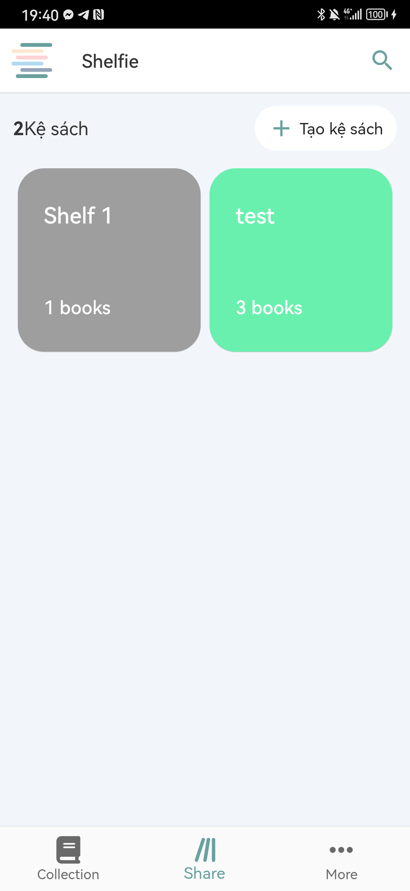
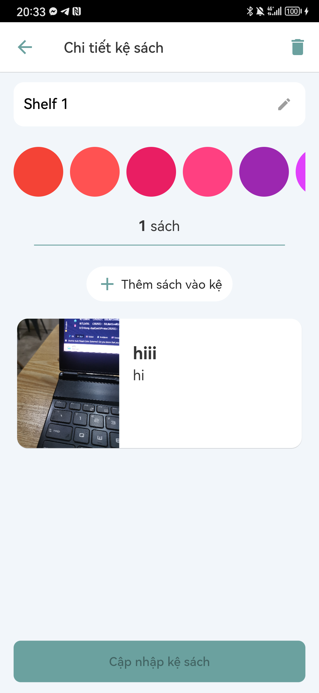
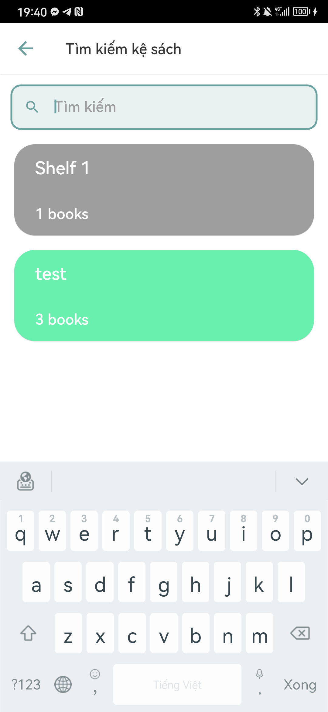

<a name="readme-top"></a>

<br />
<div align="center">
  

  <h3 align="center">Book story Application</h3>

</div>


<details>
  <summary>Table of Contents</summary>
  <ol>
    <li>
      <a href="#about-the-project">About The Project</a>
      <ul>
        <li><a href="#built-with">Built With</a></li>
      </ul>
    </li>
    <li>
      <a href="#getting-started">Getting Started</a>
      <ul>
        <li><a href="#installation">Installation</a></li>
      </ul>
    </li>
    <li><a href="#usage">Usage</a></li>
    <li><a href="#roadmap">Roadmap</a></li>
    <li><a href="#contact">Contact</a></li>
    <li><a href="#acknowledgments">Acknowledgments</a></li>
  </ol>
</details>


## About The Project

Book story is an application allows users to manage their books, arrange their books in the bookshelf. 

Migrate from old project: https://github.com/xuanthai2/book-exchange

<p align="right">(<a href="#readme-top">back to top</a>)</p>


### Built With

* Flutter framework 
* Clean architecture (no usecase/interactor)
* UiState (state machine)
* State management: Riverpod
* Firebase Baas
* Dartz (handle network calling)

<p align="right">(<a href="#readme-top">back to top</a>)</p>


<!-- GETTING STARTED -->
## Getting Started

### Installation

1. Clone the repo
   ```sh
   git clone https://github.com/phatndt/book-story
   ```
2. Run flutter pub get

3. Run project

<p align="right">(<a href="#readme-top">back to top</a>)</p>


<!-- USAGE EXAMPLES -->
## Usage

### 1. Authnetication
- login screen, forgot password screen, register screen.


<div align="center">
  
  
  
</div>

### 2. My book
- Home screen, add book screen, book detail screen, read book screen

<div align="center">
  
  
  
  
</div>

### 3. My shelf
- shelf screen, add shelf screen, shelf detail screen, search shelf screen

<div align="center">
  
  
  
  
</div>

<p align="right">(<a href="#readme-top">back to top</a>)</p>


<!-- ROADMAP -->
## Roadmap

- [ ] OCR to scan book
- [ ] Use profile


<p align="right">(<a href="#readme-top">back to top</a>)</p>


## Contact

Phat Nguyen - [linkedin](https://www.linkedin.com/in/phatndt/) - phatndt2109@gmail.com

Project Link: [book-story](https://github.com/phatndt/book-story)

<p align="right">(<a href="#readme-top">back to top</a>)</p>

## Acknowledgments

* [Flutter](https://flutter.dev/)
* [Riverpod](https://riverpod.dev/)
* [Old project ](https://github.com/xuanthai2/book-exchange)

<p align="right">(<a href="#readme-top">back to top</a>)</p>

